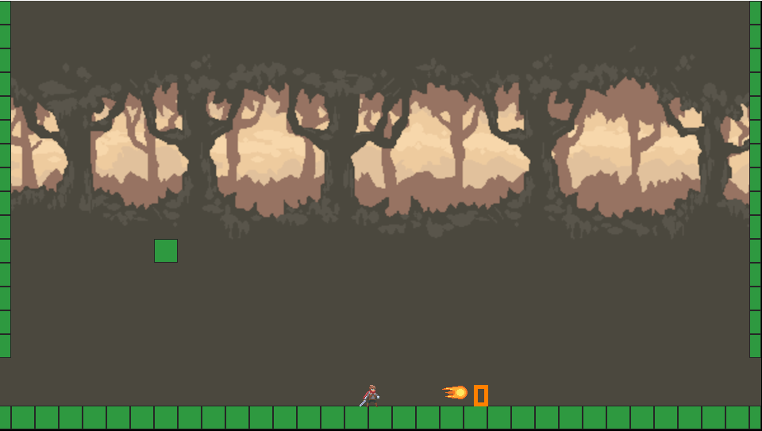

# Simple 2D Platformer Test
## Features
<ul>
<li> Basic bitmap sprites
<li> Simple game world (tile maps)
<li> Simple camera movement between tile maps
<li> Smooth scrolling
<li> Hot-reload
<li> Record and replay the input and game state
<li> Basic movement and Minkowski collision detection
</ul>

## Todos
<ul>
<li> Basic map editor
<li> Determine what kind of entities the game will have.
<li> Better collision detection and collision respond
<li> Animation system for handling bitmaps of entities
<li> Add scaling and rotating operations
<li> Render rotated bitmaps
</ul>

## Screenshot

<video width="960" height="540" controls>
  <source src="screenshots/screen_video.mp4" type="video/mp4">
</video>
